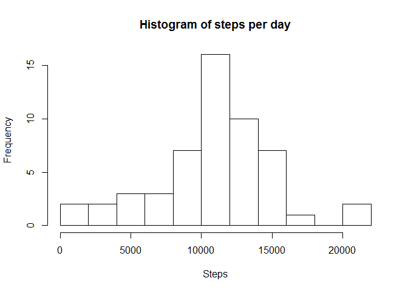

# Reproducible Research: Peer Assessment 1


## Loading and preprocessing the data
Unzip the data and load it into a data frame.

```r
unzip("activity.zip")
activity <- read.csv("activity.csv")
str(activity)
```

```
## 'data.frame':	17568 obs. of  3 variables:
##  $ steps   : int  NA NA NA NA NA NA NA NA NA NA ...
##  $ date    : Factor w/ 61 levels "2012-10-01","2012-10-02",..: 1 1 1 1 1 1 1 1 1 1 ...
##  $ interval: int  0 5 10 15 20 25 30 35 40 45 ...
```


## What is mean total number of steps taken per day?
Aggregate the data frame by day, then take the mean.

```r
steps.per.day <- aggregate(activity$steps, 
                           list(day=activity$date), sum)
hist(steps.per.day$x, 
     breaks=10, 
     main="Histogram of steps per day",
     xlab="Steps")
```


###Mean

```r
mean(steps.per.day$x, na.rm=TRUE)
```

```
## [1] 10766.19
```
###Median

```r
median(steps.per.day$x, na.rm=TRUE)
```

```
## [1] 10765
```

## What is the average daily activity pattern?


```r
avg.per.interval <- aggregate(activity$steps, 
                           list(Interval=activity$interval), 
                           function(steps){
                               mean(steps, na.rm=TRUE)
                           })

plot(avg.per.interval$Interval,
     avg.per.interval$x,
     type='l',
     main="Average daily activity",
     xlab="Interval (minutes)",
     ylab="Avg number of steps")
```


Which 5-minute interval, on average across all the days in the dataset, contains the maximum number of steps?


```r
avg.per.interval[which.max(avg.per.interval$x),"Interval"]
```

```
## [1] 835
```

## Imputing missing values

+ Calculate and report the total number of missing values in the dataset (i.e. the total number of rows with NAs)

```r
sum(!complete.cases(activity))
```

```
## [1] 2304
```
+ Devise a strategy for filling in all of the missing values in the dataset. (We will use the mean for the 5 minute interval)


```r
activity$steps <- sapply(seq_along(activity$steps), function(i) {
    if(is.na(activity$steps[[i]])) {
        avg.per.interval$x[[which(avg.per.interval$Interval == activity$interval[[i]])]]
    } else {
        activity$steps[[i]]
    }
})

steps.per.day <- aggregate(activity$steps, 
                           list(day=activity$date), sum)
hist(steps.per.day$x, 
     breaks=10, 
     main="Histogram of steps per day",
     xlab="Steps")
```


The shape of the histogram is the same but the frequencies are greater. This is to be expected given that we have added values based on the existing values.

## Are there differences in activity patterns between weekdays and weekends?


```r
activity$weekday <- weekdays(as.Date(activity$date, "%Y-%m-%d")) 
activity$is.weekend <- sapply(activity$weekday, function(day) if(day %in% c("Saturday", "Sunday")) "weekend" else "weekday")

weekend <- activity[activity$is.weekend == "weekend",]
avg.per.interval <- aggregate(weekend$steps, 
                           list(Interval=weekend$interval), 
                           function(steps){
                               mean(steps, na.rm=TRUE)
                           })
par(mfrow=c(2,1))
plot(avg.per.interval$Interval,
     avg.per.interval$x,
     type='l',
     main="Weekends",
     xlab="Interval (minutes)",
     ylab="Avg number of steps")

weekday <- activity[activity$is.weekend == "weekday",]
avg.per.interval <- aggregate(weekday$steps, 
                           list(Interval=weekday$interval), 
                           function(steps){
                               mean(steps, na.rm=TRUE)
                           })

plot(avg.per.interval$Interval,
     avg.per.interval$x,
     type='l',
     main="Weekdays",
     xlab="Interval (minutes)",
     ylab="Avg number of steps")
```


Weekday activity shows distinct peaks in the morning and evening, with weekend activity being more spread out during the day.
